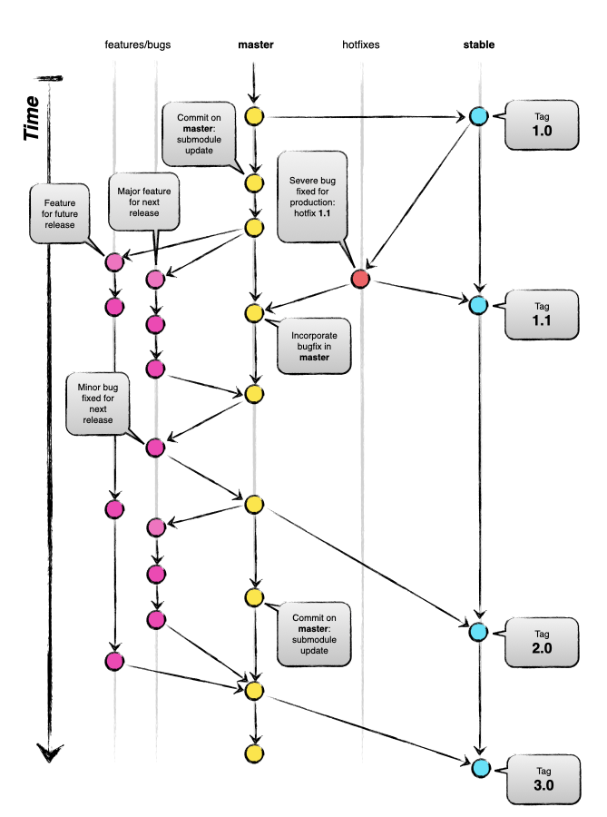

# Git Style Guide
## Table of contents
1. [Branches](#branches)
    1. [Pattern](#pattern)
    2. [Git Branching Strategies](#git-branching-strategies)
2. [General Commit Guidelines](#general-commit-guidelines)
    1. [Writing Commit Messages](#writing-commit-messages)
3. [Merging](#merging)
4. [Misc.](#misc)

### Branches

The main repository will always hold two evergreen branches:

- master
- stable

The main branch should be considered origin/master and will be the main branch where the source code of HEAD always reflects a state with the latest delivered development changes for the next release. As a developer, you will be branching and merging from master.

Consider origin/stable to always represent the latest code deployed to production. During day to day development, the stable branch will not be interacted with.

When the source code in the master branch is stable and has been deployed, all of the changes will be merged into stable and tagged with a release number. How this is done in detail will be discussed later.

#### Pattern

| Instance        | Branch        | Description, Instructions, Notes                 |
| ----------------|:-------------:| ------------------------------------------------:|
| Stable          | stable        | Accepts merges from Working and Hotfixes         |
| Working         | master        | Accepts merges from Features/Issues and Hotfixes |
| Features/Issues | as per below  | Always branch off HEAD of Working                |
| Hotfix          | hotfix-*      | Always branch off Stable                         |

#### Git Branching Strategies

Apart from having good Git Branching Strategies, it is important to follow some naming conventions to ensure proper maintenance of the repository and a clear, structured way of separating tasks. To avoid confusions and have an organised overview of every feature that is being worked on, we go through seven best practices for naming branches.

* Use Separators
When writing a branch name, using separators such as hyphen (-) or slash (/) helps to increase readability of the name. But remember to be consistent with the chosen separator for all branches names.
*Example*
`optimize-data-analysis` or `optimize/data/analysis`

2. Start Name with Category Word
It is recommended to begin the name of a branch with a category word, which indicates the type of task that is being solved with that branch. Some of the most used category words are:
    | Instance | Branch |
    | ------:| ------ |
    | `feature/` | For new features or enhancements. |
    | `bugfix/` or `fix/` | For bug fixes. |
    | `hotfix/` | For urgent fixes to the production environment. |
    | `release/` | For preparing a release version. |
    | `chore/` | For maintenance tasks or general changes. |
    | `docs/` | For documentation-related changes. |
    | `refactor/` | For code refactoring. |
    | `test/` | For testing-related changes. |

* Choose *short* and *descriptive* names:

  ```shell
  # good
  $ git checkout -b fix/oauth-migration

  # bad - too vague
  $ git checkout -b login_fix
  ```

* Identifiers from corresponding tickets in an external service (eg. a GitHub
  issue) are also good candidates for use in branch names. For example:

  ```shell
  # GitHub issue #15
  $ git checkout -b fix/issue-15-short-title
  ```

* Use lowercase in branch names. External ticket identifiers with uppercase
  letters are a valid exception. Use *hyphens* to separate words.

  ```shell
  $ git checkout -b feature/new-feature # good
  $ git checkout -b feature/T321-new-feature # good (Phabricator task id)
  $ git checkout -b New_Feature  # bad
  ```

* When several people are working on the *same* feature, it might be convenient
  to have *personal* feature branches and a *team-wide* feature branch.
  Use the following naming convention:

  ```shell
  $ git checkout -b feature-a/main # team-wide branch
  $ git checkout -b feature-a/maria  # Maria's personal branch
  $ git checkout -b feature-a/nick   # Nick's personal branch
  ```

  Merge at will the personal branches to the team-wide branch (see ["Merging"](#merging)).
  Eventually, the team-wide branch will be merged to "main".

* Delete your branch from the upstream repository after it's merged, unless
  there is a specific reason not to.

  Tip: Use the following command while being on "main", to list merged
  branches:

  ```shell
  $ git branch --merged | grep -v "\*"
  ```
  ##### Summary
 
- Keep it short and concise, but make sure to include relevant key words.
- Use category words to easily identify the type of the task.
- Include ID of related issues to help tracking of progress.
- Adding the name of the author helps to keep track of shared work.
- Keep the same name conventions for the whole project.

 
#### Workflow Diagram


#### General Commit Guidelines

When committing code, follow these general guidelines:

1. Ensure that your commits are [atomic](http://en.wikipedia.org/wiki/Atomic_commit), meaning that you group related changes, even across multiple files, into coherent and logical units. Each commit should have a well-defined and specific purpose.

2. Minimize the inclusion of unnecessary whitespace changes in your commits. You can check for these by running the following command::

   ```shell
   $ git diff --check
   ```

##### Writing Commit Messages

For writing commit messages, adhere to the following rules to enhance the clarity and traceability of your commits, making it easier for collaborators to understand your code changes and for automated systems to manage issues and pull requests effectively.

1. Start your commit message with a single line that's concise and around 50 characters, summarizing the commit. If more explanation is needed, add a blank line followed by a detailed description.

2. Maintain a consistent style by using the imperative present tense in your messages. For example:
   - Use "Add tests for" instead of "I added tests for."
   - Use "Change x to y" instead of "Changed x to y."

To link commits to GitHub Issues, include one or more issue numbers in the commit message, and optionally, specify a state change for the story. Start the commit message with square brackets containing a hash mark followed by the issue number, like this:

```plaintext
[#123] Diverting power from warp drive to torpedoes
```

To automatically close an issue with a commit message, add "Closes" within the square brackets along with the issue number, as in:

```plaintext
[Closes #123] Torpedoes now sufficiently powered
```

Note: While there are multiple ways to close an issue via a commit message, "Closes" is the recommended standard. Other options include:
- `Fixes #xxx`
- `Fixed #xxx`
- `Fix #xxx`
- `Close #xxx`
- `Closed #xxx`

You can also enclose multiple issue numbers within brackets and combine actions with commit tracking, like this:

```plaintext
[Closes #123][#124][#125] Torpedoes now sufficiently powered
```

This example would close issue 123 and add commit references to issues 124 and 125 for tracking purposes.

## Commit Message Template

Here's a suggested commit message template, inspired by [tbaggery's blog post](http://tbaggery.com/2008/04/19/a-note-about-git-commit-messages.html):

```plaintext
[<optional state> #issueid] (50 chars or less) Summary of changes

More detailed explanatory text, if necessary. Wrap it to about 72 characters or so.

Further paragraphs come after blank lines.

- Bullet points are okay, too.

- Typically, use a hyphen or asterisk as the bullet, preceded by a single space, with blank lines in between. Conventions may vary.
```


## Referances
- [Git Docs](#https://git-scm.com/docs)
- [A successful Git branching model](#https://nvie.com/posts/a-successful-git-branching-model/) (the basis for this flow model)

## License

MIT

**Free Software!**

